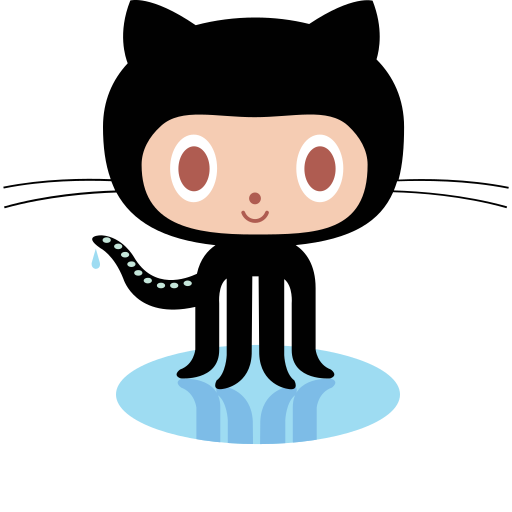

    

&nbsp;

<h2 align="center">Hey!  Nice to see you.</h2>
&nbsp;

<h3 align="center">Software Engineer with ❤️ and 🔥</h3>

> I've been an engineer professionally for 3 years, worked as a software engineer & team leader at different companies. Thanks to that, I learned a lot of skills and technologies with hands-on experience in front-end, back-end, and DevOps. Now, I am a DevOps & team leader at Viettel Solutions building [ePass](http://epass-vdtc.com.vn/) - the leading Electronic toll collection systems in Vietnam.

&nbsp;

<h3 align="center">🙋🏻‍♂️ &nbsp; Profiles</h3>

 
&nbsp;&nbsp;
&nbsp;&nbsp;
&nbsp;&nbsp;
&nbsp;&nbsp;
&nbsp;&nbsp;
&nbsp;&nbsp;

&nbsp;

<h3 align="center">👨🏻‍💻 &nbsp; Interested technologies and topics</h3>

 
&nbsp;&nbsp;
&nbsp;&nbsp;
&nbsp;&nbsp;
&nbsp;&nbsp;
&nbsp;&nbsp;
&nbsp;&nbsp;
&nbsp;&nbsp;
&nbsp;&nbsp;

&nbsp;

<!--
<h3 align="center">Skills</h3>

&nbsp;&nbsp;
&nbsp;&nbsp;
&nbsp;&nbsp;
&nbsp;&nbsp;
&nbsp;&nbsp;
&nbsp;&nbsp;
&nbsp;&nbsp;
&nbsp;&nbsp;
&nbsp;&nbsp;
&nbsp;&nbsp;
&nbsp;&nbsp;
&nbsp;&nbsp;
&nbsp;&nbsp;
&nbsp;&nbsp;
&nbsp;&nbsp;
&nbsp;&nbsp;
&nbsp;&nbsp;
&nbsp;&nbsp;
&nbsp;&nbsp;
&nbsp;&nbsp;
&nbsp;&nbsp;
&nbsp;&nbsp;

 -->

<h3 align="center">📊 &nbsp; GitHub Statistics</h3>

&nbsp;&nbsp;&nbsp;

  

  

&nbsp;

<h5 align='center'>
/ <> with ❤️ and 🔥 By <a href="https://github.com/hungnmm">Hungnmm</a> /
<h5>
